# S-Eye 2.5D Real-Time Face Recognition & AI Surveillance System

Comprehensive system documentation, architectural overview, and workflow specifications for the **S-Eye Tactical AI Surveillance Platform**.

---

## 📐 Landscape System Architecture Diagram (Left-to-Right Flow)

```mermaid
flowchart LR
    subgraph Input_Layer ["1. Camera & Video Stream Input"]
        direction TB
        C1["RTSP / IP CCTV Cameras"]
        C2["Dahua NetSDK & P2P Channels"]
        C3["Local USB Webcams"]
        FrameExtractor["Live Video Stream Reader / Frame Extractor"]
        
        C1 --> FrameExtractor
        C2 --> FrameExtractor
        C3 --> FrameExtractor
    end

    subgraph AI_Detect_Layer ["2. Face & Pose Detection Engine"]
        direction TB
        SCRFD["SCRFD-2.5G ONNX Model\n(High-speed Face & Landmark Detector)"]
        YOLO["YOLOv8-Pose Model\n(Human Body & Fall Detector)"]
        Aligner["5-Point Facial Landmark Alignment\n(112x112 Crop Matrix)"]
        
        FrameExtractor --> SCRFD
        FrameExtractor --> YOLO
        SCRFD --> Aligner
    end

    subgraph Liveness_Layer ["3. 2.5D Anti-Spoofing Check"]
        direction TB
        MiniFAS["MiniFASNetV2 ONNX Model\n(Fourier Spectrum Depth Estimation)"]
        CheckLiveness{"2.5D Real Face?\n(Score >= 0.85)"}
        
        Aligner --> MiniFAS
        MiniFAS --> CheckLiveness
    end

    subgraph Embedding_Layer ["4. ArcFace Feature Extraction"]
        direction TB
        ArcFace["ArcFace IR-50 (ResNet-50) ONNX\n(GTX 1650 FP16 CUDA Provider)"]
        Vec512["512-Dimensional Vector Embedding"]
        
        CheckLiveness -- "Yes (Real Face)" --> ArcFace
        ArcFace --> Vec512
    end

    subgraph DB_Layer ["5. Target Face Database & Matching"]
        direction TB
        SQLite_DB[("Target Faces Database\n(SQLite3 / data/target_faces.db)")]
        Matcher["L2 Normalized Cosine Similarity\n(Threshold >= 0.40)"]
        IdentityCheck{"Target Matched?"}
        
        Vec512 --> Matcher
        SQLite_DB <--> Matcher
        Matcher --> IdentityCheck
    end

    subgraph Dispatch_Layer ["6. Live Overlay & Telegram Dispatcher"]
        direction TB
        GreenBox["Live Video Overlay:\nGreen Box + Target Identity Name"]
        ResilientTG["Resilient Telegram Dispatcher\n(3x Auto-Retries + 45s Timeout)"]
        TelegramAlert["Telegram Alert Photo + Caption\n(Target Identity Name Payload)"]
        
        IdentityCheck -- "Matched (Registered Person)" --> GreenBox
        IdentityCheck -- "Matched" --> ResilientTG
        ResilientTG --> TelegramAlert
    end

    Input_Layer --> AI_Detect_Layer --> Liveness_Layer --> Embedding_Layer --> DB_Layer --> Dispatch_Layer

    classDef inputStyle fill:#1e293b,stroke:#38bdf8,stroke-width:2px,color:#fff;
    classDef aiStyle fill:#3b0764,stroke:#c084fc,stroke-width:2px,color:#fff;
    classDef liveStyle fill:#451a03,stroke:#f59e0b,stroke-width:2px,color:#fff;
    classDef embStyle fill:#042f2e,stroke:#14b8a6,stroke-width:2px,color:#fff;
    classDef dbStyle fill:#064e3b,stroke:#10b981,stroke-width:2px,color:#fff;
    classDef alertStyle fill:#450a0a,stroke:#ef4444,stroke-width:2px,color:#fff;

    class C1,C2,C3,FrameExtractor inputStyle;
    class SCRFD,YOLO,Aligner aiStyle;
    class MiniFAS,CheckLiveness liveStyle;
    class ArcFace,Vec512 embStyle;
    class SQLite_DB,Matcher,IdentityCheck dbStyle;
    class GreenBox,ResilientTG,TelegramAlert alertStyle;
```

---

## 🛠️ System Module Breakdown

### 1. 2.5D Face Recognition Pipeline
* **Detector:** **SCRFD-2.5G** ONNX (`scrfd_2.5g_bnkps.onnx`)
  * Extract 5 facial landmark keypoints (eyes, nose, mouth corners) and align face to `112x112` template using affine transformation.
* **Anti-Spoofing (Liveness):** **MiniFASNetV2** ONNX (`MiniFASNetV2.onnx`)
  * Evaluates 2.5D Fourier depth spectrum to eliminate 2D photo print and screen replay attacks.
* **Feature Extractor:** **ArcFace IR-50** ONNX (`w600k_r50.onnx`)
  * Generates 512-dimensional normalized feature embeddings. Runs on NVIDIA GTX 1650 Max-Q GPU via ONNX Runtime CUDA Execution Provider.

---

### 2. Target Face Database Management
* **Storage Location:** `data/target_faces.db` (SQLite3)
* **Image Repository:** `assets/target_faces/`
* **Security Tags & Roles:** `VIP`, `EMPLOYEE`, `SECURITY`, `BLACKLIST`, `VISITOR`
* **Cosine Similarity Matching:** Matches live vectors against pre-indexed database vectors at `threshold >= 0.40`.

---

### 3. Live Video Overlay & Telegram Dispatcher
* **Live Video Display:** Draws green bounding box and displays person's name + match percentage (e.g. `NAME: MG MG (89%)`).
* **Resilient Telegram Dispatcher:**
  * Uses `HTTPAdapter` with `urllib3.util.Retry` for 3x automatic retries with exponential backoff (`1.5s`, `3s`, `6s`).
  * Extended timeout `(12, 45)` prevents `ReadTimeout` exceptions over slow connections.
  * Formats alert message with `👤 Target Identity: <REGISTERED_NAME>`.

---

## 🖼️ Generated Output Files

* 📄 **Documentation File:** [`project_flowchart.md`](file:///e:/project/S%20Eye/project_flowchart.md)
* 🖼️ **Landscape Flowchart Image (HD):** [`project_flowchart.png`](file:///e:/project/S%20Eye/project_flowchart.png)
* 🖼️ **Landscape Flowchart Alternate:** [`project_flowchart_landscape.png`](file:///e:/project/S%20Eye/project_flowchart_landscape.png)
