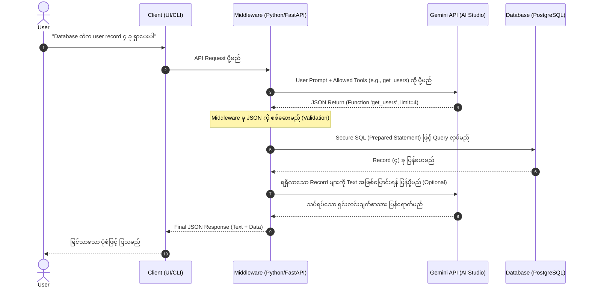

# Project: AI-Driven Infrastructure & Database Management System
**Version:** 2.0.0 (Updated with Python Integration & Mermaid Flowchart)
**Author:** Lead System Architect

## 1. System Flowchart (Mermaid)

အောက်ပါ Flowchart သည် User မှ စာရိုက်လိုက်သည့်အချိန်မှစ၍ Middleware (Python) မှ တစ်ဆင့် Gemini AI သို့ရောက်ရှိပြီး Database ကို မည်သို့လုံခြုံစွာ ခေါ်ယူသွားသည်ကို ပြသထားပါသည်။

## 3. မှတ်ချက်
- **Security:** AI ကို Database Access Password/Credentials ပေးစရာမလိုပါ။ AI သည် ဘယ် Function ကို ဘာ Parameter ဖြင့် ခေါ်ရမည်ကိုသာ Middleware ထံ ပြန်ပြောပေးခြင်းဖြစ်သည်။ အမှန်တကယ် Database ချိတ်ဆက်ခြင်းကို Middleware (Python) မှ တာဝန်ယူပါသည်။
- **Extensibility:** နောက်ပိုင်း `restart_server()` သို့မဟုတ် `delete_logs()` စသည့် Function များကို လိုအပ်ပါက Python တွင်ရေးပြီး `tools=[]` အတွင်း ထည့်သွင်းပေးရုံသာ ဖြစ်ပါသည်။
